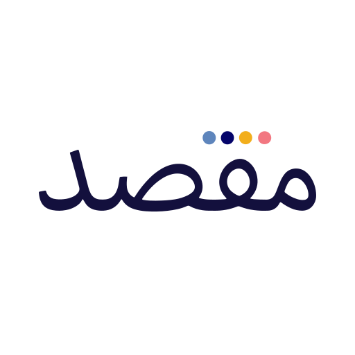

# @maqsad/icons

<p align="center">
  
</p>

<p align="center">
  A comprehensive React icon library featuring both system icons and illustration icons with multiple variants.
</p>

<p align="center">
  <a href="https://www.npmjs.com/package/@maqsad/icons"></a>
  <a href="https://www.npmjs.com/package/@maqsad/icons"></a>
  <a href="https://github.com/maqsad-io/maqsad-icons/blob/main/LICENSE"></a>
</p>

## Table of Contents

- [Installation](#installation)
- [Usage](#usage)
  - [System Icons](#system-icons)
  - [Illustration Icons](#illustration-icons)
- [Available Icons](#available-icons)
- [Variants Explained](#variants-explained)
- [Adding New Icons](#adding-new-icons)
- [Development](#development)
- [Tree Shaking](#tree-shaking)
- [TypeScript](#typescript)
- [License](#license)

## Installation

```bash
pnpm add @maqsad/icons
# or
npm install @maqsad/icons
# or
yarn add @maqsad/icons
```

## Usage

### System Icons

System icons are available in two styles: **stroke** (outline-based) and **filled**. All icons can be scaled to any size.

```tsx
import { IconArrowBack, IconSearch, IconStar } from "@maqsad/icons";
// or import specifically from system
import { IconArrowBack } from "@maqsad/icons/system";

function App() {
  return (
    <div>
      {/* Default size (24px) */}
      <IconArrowBack />

      {/* Custom size */}
      <IconSearch size={18} />

      {/* Custom stroke color */}
      <IconStar stroke="gold" />

      {/* Custom fill color */}
      <IconStar fill="gold" />

      {/* Custom stroke width */}
      <IconArrowBack strokeWidth={1.5} />

      {/* With className for styling */}
      <IconSearch className="my-icon" />
    </div>
  );
}
```

#### System Icon Props

| Prop          | Type       | Default          | Description                                  |
| ------------- | ---------- | ---------------- | -------------------------------------------- |
| `size`        | `number`   | `24`             | Icon size in pixels                          |
| `stroke`      | `string`   | `'currentColor'` | Icon stroke color                            |
| `fill`        | `string`   | `'none'`         | Icon fill color                              |
| `color`       | `string`   | `'currentColor'` | Icon stroke color (deprecated, use `stroke`) |
| `strokeWidth` | `number`   | `2`              | Stroke width                                 |
| `className`   | `string`   | -                | CSS class name                               |
| `...props`    | `SVGProps` | -                | Any valid SVG props                          |

### Illustration Icons

Illustration icons are more detailed icons with multiple color variants.

```tsx
import { IllustrationNotes, IllustrationVideoLectures } from "@maqsad/icons";
// or import specifically from illustrations
import { IllustrationNotes } from "@maqsad/icons/illustrations";

function App() {
  return (
    <div>
      {/* Default variant (primary - blue) */}
      <IllustrationNotes />

      {/* Secondary variant (brown/pink) */}
      <IllustrationNotes variant="secondary" />

      {/* Dark variant (for light theme) */}
      <IllustrationNotes variant="dark" />

      {/* Light variant (for dark theme) */}
      <IllustrationNotes variant="light" />

      {/* Filled variant with custom colors */}
      <IllustrationNotes
        variant="filled"
        primaryColor="#8B5CF6"
        accentColor="#F59E0B"
      />

      {/* Custom size */}
      <IllustrationVideoLectures size={64} />
    </div>
  );
}
```

#### Illustration Icon Props

| Prop           | Type                                                        | Default     | Description                      |
| -------------- | ----------------------------------------------------------- | ----------- | -------------------------------- |
| `variant`      | `'primary' \| 'secondary' \| 'filled' \| 'dark' \| 'light'` | `'primary'` | Icon color variant               |
| `size`         | `number`                                                    | `48`        | Icon width in pixels             |
| `primaryColor` | `string`                                                    | `'#3B82F6'` | Primary color for filled variant |
| `accentColor`  | `string`                                                    | `'#F59E0B'` | Accent color for filled variant  |
| `className`    | `string`                                                    | -           | CSS class name                   |
| `...props`     | `SVGProps`                                                  | -           | Any valid SVG props              |

## Available Icons

**Total: 106 icons** (90 system icons + 16 illustration icons)

> For a complete list with import examples, see [ICONS.md](./src/ICONS.md)

### System Icons (90)

<table>
  <tr>
    <td align="center"><br /><sub>Alert</sub></td>
    <td align="center"><br /><sub>AlertCircle</sub></td>
    <td align="center"><br /><sub>ArrowBack</sub></td>
    <td align="center"><br /><sub>ArrowForward</sub></td>
    <td align="center"><br /><sub>BadgeCheckFilled</sub></td>
    <td align="center"><br /><sub>Bell</sub></td>
    <td align="center"><br /><sub>Book</sub></td>
  </tr>
  <tr>
    <td align="center"><br /><sub>Bookmark</sub></td>
    <td align="center"><br /><sub>Calculator</sub></td>
    <td align="center"><br /><sub>Calculator2</sub></td>
    <td align="center"><br /><sub>Camera</sub></td>
    <td align="center"><br /><sub>Chat</sub></td>
    <td align="center"><br /><sub>ChatFilled</sub></td>
    <td align="center"><br /><sub>Check</sub></td>
  </tr>
  <tr>
    <td align="center"><br /><sub>CheckCircle</sub></td>
    <td align="center"><br /><sub>CheckCircleFilled</sub></td>
    <td align="center"><br /><sub>Chemistry</sub></td>
    <td align="center"><br /><sub>ChevronBack</sub></td>
    <td align="center"><br /><sub>ChevronDown</sub></td>
    <td align="center"><br /><sub>ChevronForward</sub></td>
    <td align="center"><br /><sub>ChevronUp</sub></td>
  </tr>
  <tr>
    <td align="center"><br /><sub>ChevronUp</sub></td>
    <td align="center"><br /><sub>Close</sub></td>
    <td align="center"><br /><sub>CreditCard</sub></td>
    <td align="center"><br /><sub>Crown</sub></td>
    <td align="center"><br /><sub>Delete</sub></td>
    <td align="center"><br /><sub>Dislike</sub></td>
    <td align="center"><br /><sub>Download</sub></td>
  </tr>
  <tr>
    <td align="center"><br /><sub>Edit</sub></td>
    <td align="center"><br /><sub>Envelope</sub></td>
    <td align="center"><br /><sub>Feedback</sub></td>
    <td align="center"><br /><sub>Filter</sub></td>
    <td align="center"><br /><sub>Help</sub></td>
    <td align="center"><br /><sub>History</sub></td>
    <td align="center"><br /><sub>Home</sub></td>
  </tr>
  <tr>
    <td align="center"><br /><sub>Info</sub></td>
    <td align="center"><br /><sub>KebabMenu</sub></td>
    <td align="center"><br /><sub>Like</sub></td>
    <td align="center"><br /><sub>Loader</sub></td>
    <td align="center"><br /><sub>Logout</sub></td>
    <td align="center"><br /><sub>Maths</sub></td>
    <td align="center"><br /><sub>NegativeCircleFilled</sub></td>
  </tr>
  <tr>
    <td align="center"><br /><sub>PadlockLocked</sub></td>
    <td align="center"><br /><sub>PencilHand</sub></td>
    <td align="center"><br /><sub>Physics</sub></td>
    <td align="center"><br /><sub>Pin</sub></td>
    <td align="center"><br /><sub>PinFilled</sub></td>
    <td align="center"><br /><sub>QuestionBank</sub></td>
    <td align="center"><br /><sub>Reset</sub></td>
  </tr>
  <tr>
    <td align="center"><br /><sub>RotateScreen</sub></td>
    <td align="center"><br /><sub>Search</sub></td>
    <td align="center"><br /><sub>Share</sub></td>
    <td align="center"><br /><sub>ShareArrow</sub></td>
    <td align="center"><br /><sub>Sikkay</sub></td>
    <td align="center"><br /><sub>Smiley</sub></td>
    <td align="center"><br /><sub>Sort</sub></td>
  </tr>
  <tr>
    <td align="center"><br /><sub>Star</sub></td>
    <td align="center"><br /><sub>StarFilled</sub></td>
    <td align="center"><br /><sub>Test</sub></td>
    <td align="center"><br /><sub>VideoPlay</sub></td>
    <td align="center"><br /><sub>VideoSkip</sub></td>
    <td align="center"><br /><sub>Whatsapp</sub></td>
    <td align="center"><br /><sub>WrenchGear</sub></td>
  </tr>
</table>

### Illustration Icons (16)

<table>
  <tr>
    <td align="center"><br /><sub>AvatarFemale</sub></td>
    <td align="center"><br /><sub>AvatarGeneric</sub></td>
    <td align="center"><br /><sub>AvatarMale</sub></td>
    <td align="center"><br /><sub>Doubtsolve</sub></td>
  </tr>
  <tr>
    <td align="center"><br /><sub>Giki</sub></td>
    <td align="center"><br /><sub>Iba</sub></td>
    <td align="center"><br /><sub>LiveSessions</sub></td>
    <td align="center"><br /><sub>LogoMaqsad</sub></td>
  </tr>
  <tr>
    <td align="center"><br /><sub>LogoMaqsad512BgWhite</sub></td>
    <td align="center"><br /><sub>Lums</sub></td>
    <td align="center"><br /><sub>MissHumaConfused</sub></td>
    <td align="center"><br /><sub>Notes</sub></td>
  </tr>
  <tr>
    <td align="center"><br /><sub>Notes2</sub></td>
    <td align="center"><br /><sub>Sikka</sub></td>
    <td align="center"><br /><sub>Tests</sub></td>
    <td align="center"><br /><sub>VideoLectures</sub></td>
  </tr>
</table>

## Variants Explained

| Variant     | Preview                                                                                                                                                        | Description             | Use Case                   |
| ----------- | -------------------------------------------------------------------------------------------------------------------------------------------------------------- | ----------------------- | -------------------------- |
| `primary`   |      | Blue color scheme       | Default, general use       |
| `secondary` |  | Brown/pink color scheme | Alternative styling        |
| `dark`      |            | Dark monotone           | Icons on light backgrounds |
| `light`     |          | Light monotone          | Icons on dark backgrounds  |

## Adding New Icons

### System Icons

1. Add your SVG file to `assets/system/stroke/` (for outline icons) or `assets/system/filled/` (for filled icons)
2. Run `pnpm build:icons`

### Illustration Icons

1. Add your SVG files to `assets/illustrations/{variant}/` for each variant
2. Run `pnpm build:icons`

## Development

```bash
# Install dependencies
pnpm install

# Build icons from SVG assets
pnpm build:icons

# Build the library
pnpm build

# Type check
pnpm typecheck
```

## Tree Shaking

This library is fully tree-shakeable. Import only the icons you need:

```tsx
// ✅ Good - only imports what you need
import { IconSearch, IconHeart } from "@maqsad/icons";

// ✅ Also good - imports from specific subpath
import { IconSearch } from "@maqsad/icons/system";
import { IllustrationNotes } from "@maqsad/icons/illustrations";
```

## TypeScript

Full TypeScript support with exported types:

```tsx
import type {
  SystemIconProps,
  IllustrationIconProps,
  SystemIconSize,
  IllustrationVariant,
} from "@maqsad/icons";
```

## License

MIT
